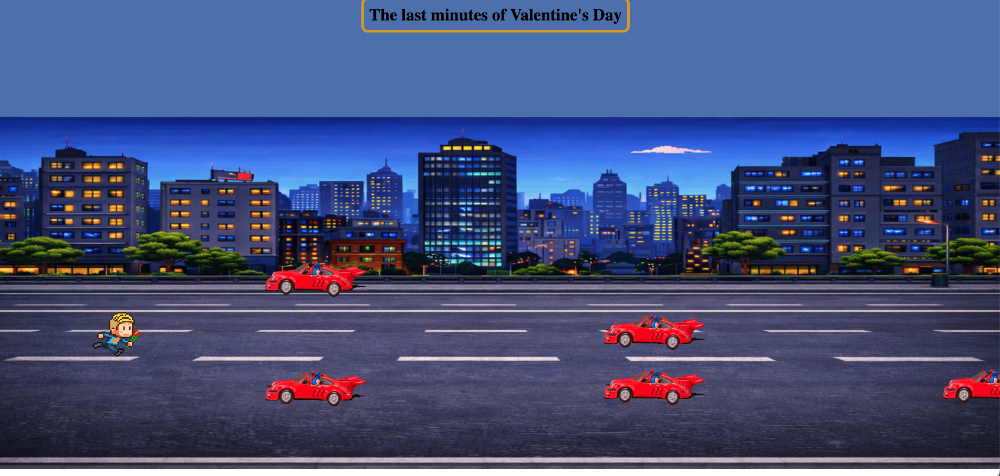

# The last minutes of Valentine’s Day

## Descripción
Juego estilo “runner” en el que controlas a un personaje que se mueve arriba y abajo entre **4 carriles** para esquivar coches que vienen desde la derecha.  
El objetivo es **aguantar el máximo tiempo posible** sin colisionar.

---

## Instrucciones para jugar

### Controles
- **⬆️ Flecha arriba (ArrowUp):** sube 1 carril  
- **⬇️ Flecha abajo (ArrowDown):** baja 1 carril  

### Objetivo
Evita chocar con los coches. Si colisionas, aparece el mensaje **GAME OVER** y la partida termina.

### Requisitos para que cualquiera pueda jugar
- Solo necesitas abrir el enlace del juego.
- No hace falta instalar nada para jugar.

---

## Enlace a la versión final (GitHub Pages)
- xxxx
